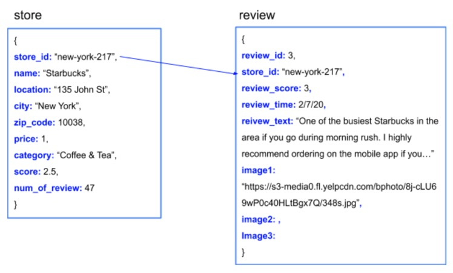

# Yelp-Website-Scraping-with-Beautiful-Soup

**Description**

This project shows the whole process of scraping information of Starbucks stores in ten cities from Yelp website. I stored all the data into MangoDB since it has a flexible sturecture and more stable for large-scale data storage. You can easily change the store name to others based on your interests. The scraped data can be used to do review analysis, image analysis for each store or business analysis across industries.

**Data Structure**

Besides reviews. I scraped 9 fields for each store: “store_id”, “name”, “location”, “city”, “zip_code”, “price”, “category”, “score”, and “num_of_review”. For the aspect of reviews, I scraped 20 reviews for each store, and “store_id”, “review_score”, “review_time”, “review_text”, “image1”, “image2”, and “image3” are also scraped along with each review. I separated all data into two collections in order to save storage space, because if just putting them into one collection the documents in collection 1 would repeat twenty times. The structure of the database is shown below.

**Technical Skills**

The packages used for scraping are Beautiful Soup and Seledium in Python. Besides, regular expression and HTML are prerequired skills.

**Note**
1. If you are interested about review analysis on Yelp website, welcome to have a look at my another project at: https://github.com/Cryyyystal/Analysis-of-Yelp-Review-for-Chipotle-Mexican-Grill

2. The code might not work due to HTML structure change of the website.
